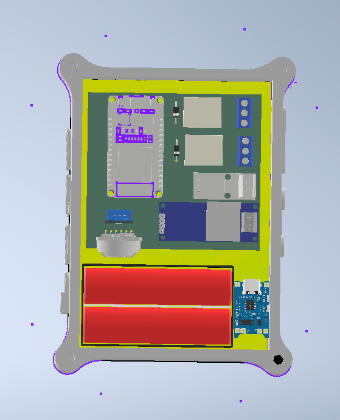

# GriyaTech
## Smart-Building-System-Berbasis IoT

Proyek ini bertujuan untuk mengembangkan sistem automasi cerdas berbasis IoT untuk Smart Building, menggunakan komponen utama seperti ESP32, RTC, dan berbagai sensor. ESP32 bertindak sebagai mikroprosesor utama yang mengontrol komunikasi antar sensor dan perangkat, memungkinkan pemantauan dan pengontrolan secara real-time melalui jaringan Wi-Fi. Sistem ini dilengkapi dengan RTC (Real-Time Clock) untuk menjaga sinkronisasi waktu, serta sensor suhu DHT11 yang digunakan untuk mengoptimalkan pengaturan suhu dan kelembaban di dalam gedung.

Untuk memantau konsumsi energi, digunakan sensor arus ACS712 dan sensor tegangan ZMPT101B yang secara akurat mengukur penggunaan listrik dan tegangan pada berbagai perangkat. Selain itu, Relay SPDT (3A 3,3V) berfungsi sebagai saklar otomatis yang memungkinkan pengendalian perangkat elektronik seperti lampu dan sistem pendingin. 

Dengan bantuan teknologi IoT, seluruh data dari sensor-sensor ini dikirimkan ke platform cloud, memungkinkan pemilik gedung untuk memantau penggunaan energi dan kondisi lingkungan secara langsung dari aplikasi mobile. Sistem ini dirancang untuk meningkatkan efisiensi energi, kenyamanan, serta keamanan penghuni gedung dengan mengotomatiskan berbagai fungsi dan memberikan kendali yang lebih fleksibel.

## Support By :
>- Dosen Pengampu : Akhmad Hendriawan ST., MT. (NIP.197501272002121003)
>- Mata kuliah : IoT dan Jaringan Sensor
>- Program Studi : D4 Teknik Elektronika
>- Politeknik Elektronika Negeri Surabaya 

## Team Member :
|      NRP      |       Nama      |    Jobdesk    |   Akun |
| :-----------:|:----------------:| :------------:| :-----:|
| 2122600003    | Raditya Giananta  | Hardware Developer       | [Radit](https://github.com/Raditya-G)
| 2122600006    | Nataratungga Xina T         |   UI/UX Designer | [Ratu](https://github.com/nataratungga)
| 2122600007    | Bisma Arya Putra         |    Programmer      | [Bisma](https://github.com/Bismaap)
| 2122600012    | Nur Rohmat Hidayat                | Project Manager | [Rohmat](https://github.com/NurRohmatHidayat)
| 2122600020    | Ezar Prasetya               | UI/UX Designer     | [Ezar](https://github.com/EzarPrasetya)
| 2122600030    | Ziyad Nur Muhammad               | 3D Designer     |[Ziyad](https://github.com/Yadnur)

## Daftar Isi
- [Komponen Yang Digunakan](#Komponen-Yang-Digunakan)
- [Wiring Plan](#Wiring-Plan)
- [Hardware](#Hardware)
- [Desain 3D](#Desain-3D)
- [Program ESP32](#Program-ESP32)
- [Program Design UI/UX](#Pogram-Design-UI/UX)

 
## Komponen Yang Digunakan
1. **Hardware** 
    a. ESP32 
    b. Shield PCB 
    c. RTC 
    d. Sensor Suhu DHT11 
    e. Sensor Arus ACS712 
    f. Sensor Tegangan (ZMPT101B) 
    g. Relay SPDT (3A 3,3V) 

2. **Software** 
    a. Arduino ide 
    b. KiCad 
    c. Inventor 
    d. Visual Studio Code (VSC) 
    e. Eagle 

3. **Alat** 
    a. Solder 
    b. Timah solder 
    c. Kabel jumper 
    d. Breadboard 
    e. Obeng 
 
## Wiring Plan
>- First Floor Plan
>- 
>- Second Floor Plan
>- 

## [Hardware](https://github.com/NurRohmatHidayat/Smart-Building-Solution/tree/main/Hardware)

Berikut ini adalah hasil skematik rangkaian Smart Building System IoT menggunakan software KiCad.

Berikut ini adalah hasil 3D dari  rangkaian Smart Building System IoT menggunakan software KiCad.

Berikut ini adalah hasil 3D dari  rangkaian Smart Building System IoT menggunakan software KiCad.

## [Desain 3D](https://github.com/NurRohmatHidayat/Smart-Building-Solution/tree/main/Desain%203D)

1. Desain 3D Casing Top  

2. Desain 3D Casing Down  

3. Desain 3D Using Komponen  

Berikut adalah Link Thingivers Design 3D. Klik link Video Simulasi Software [Thingivers](https://www.thingiverse.com/thing:6796394)

## Program ESP32

Program utama dari projek ini :
- [Arduino dengan C](https://github.com/NurRohmatHidayat/Smart-Building-Solution/tree/main/Program%20ESP32/Smart%20Building/Smart%20Building/src)

Berikut adalah video demontrasi prototype hardware. Klik link [Video Simulasi Prototype](https://youtube.com/shorts/licZBOOe8F4?feature=share)

Berikut ini adalah hasil rangkaian Prototype Smart Building System IoT.

Simulasi ini kami menggunakan ESP32 untuk mengontrol sensor dan modul yang terhubung di breadboard. Simulasi dilakukan menggunakan Wokwi, yang memudahkan pengujian rangkaian secara virtual sebelum implementasi fisik. Rangkaian melibatkan sensor DHT22, modul relay, LED indikator, potensiometer, dan RTC untuk sinkronisasi waktu.

Relay digunakan untuk mengontrol perangkat eksternal, sementara LED menunjukkan status sistem. Simulasi ini membantu dalam debugging dan memastikan komunikasi antar komponen berjalan baik. Meskipun Wokwi tidak menyediakan semua komponen, platform ini sangat berguna untuk pengujian dan visualisasi fungsi dasar rangkaian, membantu mengidentifikasi masalah sebelum produksi fisik.

Berikut adalah video demontrasi alat menggunakan wokwi. Klik link [Video Simulasi Software](https://youtu.be/oXDYyiHHBaU "Video Simulasi Software")

## [Program Design UI/UX]

Node-RED digunakan sebagai back end untuk proyek web kami, yang berfungsi mengelola aliran data dan pemrosesannya. Data yang ditampilkan pada antarmuka web berasal dari broker MQTT di mqtt.cool, di mana Node-RED berlangganan ke topik yang relevan, memproses data sesuai kebutuhan, dan menyajikannya ke front end. Pengaturan ini memungkinkan penanganan data secara real-time dan integrasi yang efisien dengan platform web kami.

Berikut adalah alur dari program Node Red yang berfungsi untuk menerima data mqtt.cool kemudian disimpan pada database Mysql.

Berikut ini adalah program untuk Back-end Smart Building System IoT menggunakan Node-RED [Node-RED](https://github.com/NurRohmatHidayat/Smart-Building-Solution/tree/main/UI/UX%20Designer)

Berikut ini adalah program untuk WEB Smart Building System IoT menggunakan bahasa HTML [Program](https://github.com/NurRohmatHidayat/Smart-Building-Solution/tree/main/UI/UX%20Designer/node-red)
