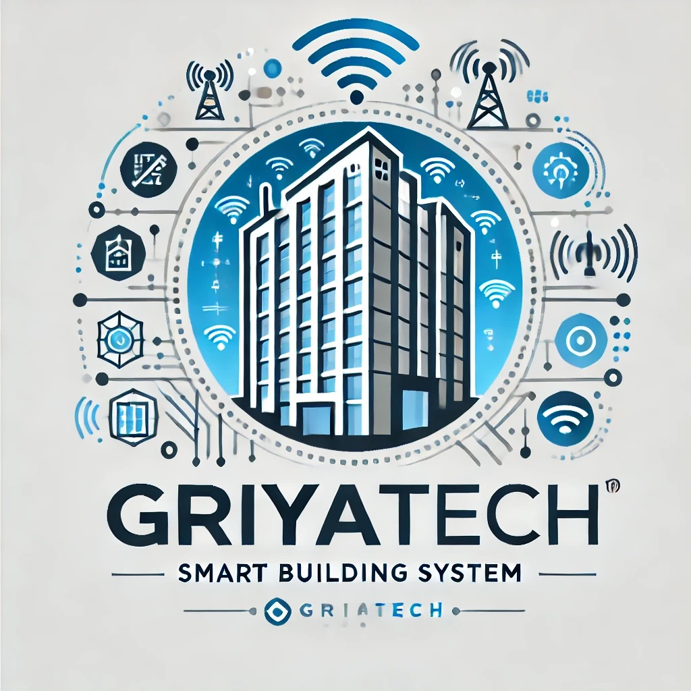

# GriyaTech
## Smart-Building-System-Berbasis IoT

Proyek ini bertujuan untuk mengembangkan sistem automasi cerdas yang terintegrasi pada gedung bertingkat untuk kebutuhan Smart Building. Sistem ini akan memungkinkan pemilik rumah atau penghuni gedung untuk memonitor dan mengontrol perangkat elektronik serta lingkungan, seperti pencahayaan, AC, keamanan, dan konsumsi energi, secara real-time melalui platform IoT. Solusi ini berfokus pada peningkatan efisiensi energi, kenyamanan, dan keamanan dengan memanfaatkan teknologi berbasis sensor dan cloud.

## Support By :
>- Dosen Pengampu : Akhmad Hendriawan ST., MT. (NIP.197501272002121003)
>- Mata kuliah : IoT dan Jaringan Sensor
>- Program Studi : D4 Teknik Elektronika
>- Politeknik Elektronika Negeri Surabaya 

## Team Member :
|      NRP      |       Nama      |    Jobdesk    |   Akun |
| :-----------:|:----------------:| :------------:| :-----:|
| 2122500003    | Raditya Giananta  | Hardware Developer       | [Radit](https://github.com/Radit-Gi)
| 2122500006    | Nataratungga Xina T         |   UI/UX Designer | [Ratu](https://github.com/nataratungga)
| 2122500007    | Bisma Arya Putra         |    Programmer      | [Bisma](https://github.com/Bismaap)
| 2122500012    | Nur Rohmat Hidayat                | Project Manager | [Rohmat](https://github.com/NurRohmatHidayat)
| 2122500020    | Ezar Prasetya               | UI/UX Designer     | [Ezar](https://github.com/EzarPrasetya)
| 2122500030    | Ziyad Nur Muhammad               | 3D Designer     |[Ziyad](https://github.com/Yadnur)

## Daftar Isi
- [Komponen Yang Digunakan](#Komponen-Yang-Digunakan)
- [Wiring Plan](#Wiring-Plan)
- [Hardware](#Hardware)
- [Desain 3D](#Desain-3D)
- [Program ESP32](#Program-ESP32)
- [Program Design UI/UX](#Pogram-Design-UI/UX)

## Komponen Yang Digunakan
1. ESP32
2. Shield PCB
3. RTC
4. Sensor Suhu DHT11
5. Sensor Arus ACS712
6. Sensor Tegangan (ZMPT101B)
7. Relay SPDT (3A 3,3V)

## Wiring Plan
>- First Floor Plan
>- 
>- Second Floor Plan
>- 

## [Hardware](https://github.com/NurRohmatHidayat/Smart-Building-Solution/tree/main/Hardware)

Berikut ini adalah hasil skematik rangkaian Smart Building System IoT menggunakan software KiCad.

Berikut ini adalah hasil 3D dari  rangkaian Smart Building System IoT menggunakan software KiCad.

## [Desain 3D](https://github.com/NurRohmatHidayat/Smart-Building-Solution/tree/main/Desain%203D)

1. Desain 3D Casing Atas  

2. Desain 3D Casing Bawah  

3. Desain 3D Casing + Komponen  

## Program ESP32

Program utama dari projek ini :
- [Arduino dengan C](https://github.com/NurRohmatHidayat/Smart-Building-Solution/tree/main/Program%20ESP32)

Berikut ini adalah hasil rangkaian simulasi Smart Building System IoT menggunakan Wokwi.

Berikut adalah video demontrasi alat menggunakan wokwi. Klik link [youtube berikut]("youtube berikut")

## [Program Design UI/UX](https://github.com/NurRohmatHidayat/Smart-Building-Solution/tree/main/UI/UX%20Designer)

